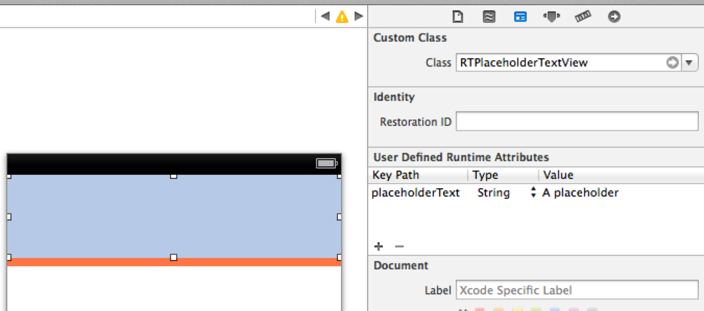
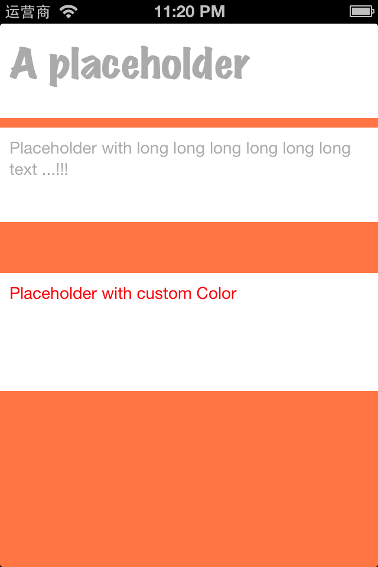

RTPlaceholderTextView
=====================

A UITextView with placeholder supported

Features
----

- placeholder text and custom placehoder color
- iOS 7 compitible

Usage
----

*With IB*

*With Code*

    RTPlaceholderTextView * textView = [[RTPlaceholderTextView alloc] init];
    textView.placeholderText = @"placholder";
    textView.placeholderTextColor = [UIColor redColor];
    ...
    

Screenshot
----

